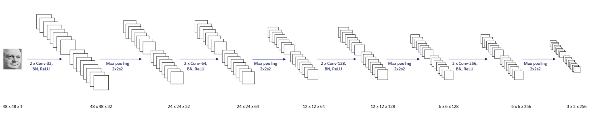

## Smile-Detection-of-Human-faces

-  This is smile detection algorithm built using Keras.

### DATASET USED 
- [The MPLab GENKI Database](https://inc.ucsd.edu/mplab/wordpress/wp-content/uploads/genki4k.tar)

### Libraries used
- Keras
- OpenCV
- pandas
- numpy

### Architecture

### Reference
- Happy Houses assignment on Convolution Neural Network course on coursera

- [smile detection github repo of truongnmt](https://github.com/truongnmt/multi-task-learning)

- Dinh Viet Sang, Le Tran Bao Cuong, and Do Phan Thuan. 2017., Facial Smile Detection Using Convolutional Neural Networks. In The 9th International Conference on Knowledge and Systems Engineering (KSE 2017). 138–143.  
Model architecture from this paper.