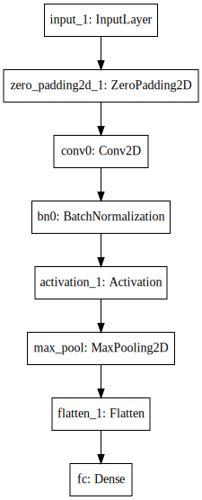

## Smile-Detection-of-Human-faces

-  This is smile detection algorithm built using Keras.

### DATASET USED 
- [The MPLab GENKI Database](https://inc.ucsd.edu/mplab/wordpress/wp-content/uploads/genki4k.tar)

### Libraries used
- Keras
- OpenCV
- pandas
- numpy

### Architecture

### Reference
- Happy Houses assignment on Convolution Neural Network course on coursera